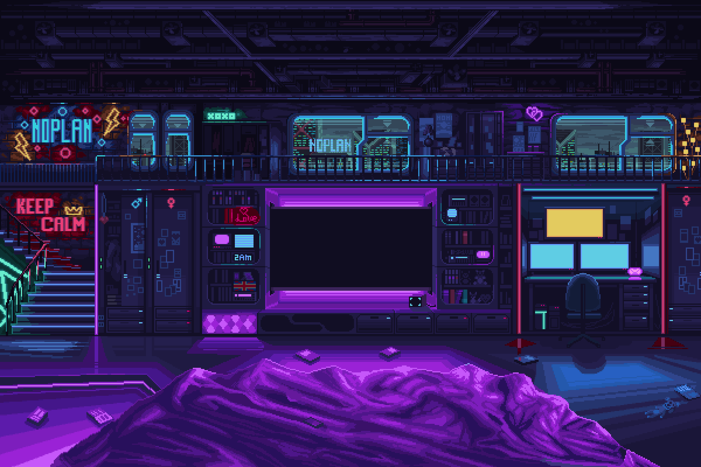

<h1 align="center">Welcome to my GitHub profile!</h1>

   

<h1 align="center"> About Me</h1>

  <b>👋 Hi there! I'm Xx_Zer042_xX, passionate about the world of computer science. I love tackling programming challenges, focusing on mastering the C language and the Unix shell Bash used on systems like Linux and macOS.</b> 
   🌟 Alongside this, I'm exploring the potential of C++ and Unreal Engine, discovering their capabilities for game development and beyond. I also have a keen interest in Arduino and Flipper Zero, which I explore as hobbies. 
   🔧 Always eager to expand my knowledge and enhance my development skills, I'm excited about collaborating on innovative projects and contributing to cutting-edge software solutions. 
   🚀 Feel free to reach out to me for discussions on exciting collaborations or to exchange ideas on programming challenges!

## 🌱 Learning

- C language
- Basic computer concepts
- Algorithms and data structures

## 🚀 Projects

### Project 1: Hello World in C

This is a simple "Hello, World!" program written in C.

### Project 2: Calculator in C

A simple calculator implemented in C. You can try the online version here:

---

## Additional Additions

### Fun GIF

Here's a fun animated GIF:

### Technologies I'm Proficient In

- **Programming Languages**: C, Python, HTML/CSS, JavaScript
- **Frameworks**: Flask, Bootstrap
- **Development Tools**: Git, Visual Studio Code, Docker

### Open Source Contributions

I have contributed to several open source projects by providing fixes and improving documentation.

### Personal Projects

#### Web Portfolio

A personal portfolio developed in HTML, CSS, and JavaScript to showcase my projects.

#### Python Game

A simple game developed in Python. You can try it online or view the code on GitHub.

### Badges

Here are some badges:

### Contact

To get in touch with me or learn more about my projects, feel free to visit my [GitHub profile](https://github.com/your-username) or email me at your@email.com.
