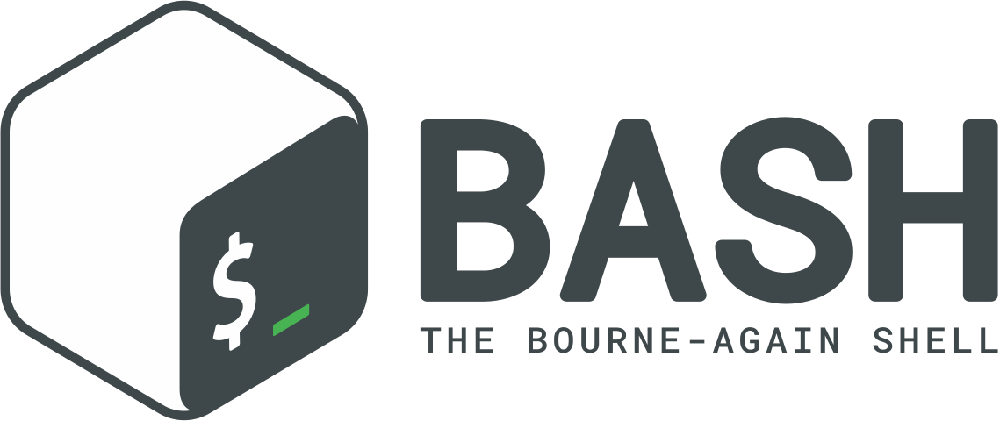

<h1 align="center">Welcome to my GitHub profile!</h1>

  

  <b>👋 Hi there! I'm Xx_Zer0_xX, passionate about video games, hardware, and software. At 37, after working as an automotive mechanic for over 10 years, I've decided to pivot into the field of IT. Currently, I'm gearing up to join Ecole 42 in Lausanne, Switzerland.</b>  
  <b>🌟 My interest in IT sparked from my love for video games. I'm fascinated by how hardware and software interact to create interactive and immersive experiences.</b>  
  <b>🔧 Alongside preparing for Ecole 42, I'm actively exploring opportunities in game development and diving deep into hardware and software exploration. I'm always on the lookout for new technologies and methods to enhance my skills.</b>  
  <b>🚀 I'm excited to immerse myself in the world of IT, expand my knowledge and skills, and contribute to innovative projects. I aspire to play an active role in developing advanced software solutions and engaging in stimulating collaborations.</b>  
  <b>💬 Feel free to reach out to me for discussions on exciting collaborations, exchanging ideas about video games and IT, or simply sharing a common passion!</b>

 

<h2 align="center">Join Ecole 42:</h2>

  <b>Explore the innovative approach to education at Ecole 42 and join a global community of passionate learners.</b>  
  <i>* Please note that this is not an official representation of Ecole 42 but a personal recommendation.</i>  
  

 

<h2 align="center">Skills and Learning:</h2>

### Languages

### Tools

<h2 align="center">Experience and Education:</h2>

### Education 
  - Automotive Mechanic CFC (Certificat Fédéral de Capacité), Switzerland

### Professional Experience: 
  - Over 10 years of experience as an automotive mechanic
  - Currently transitioning into the field of IT and preparing to join Ecole 42 in Lausanne, Switzerland
